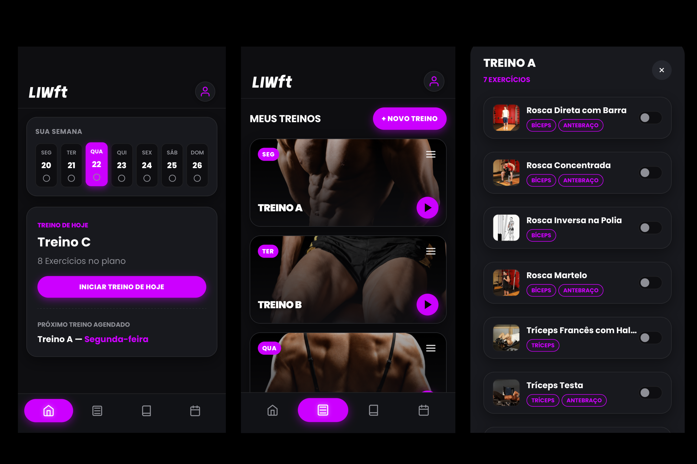
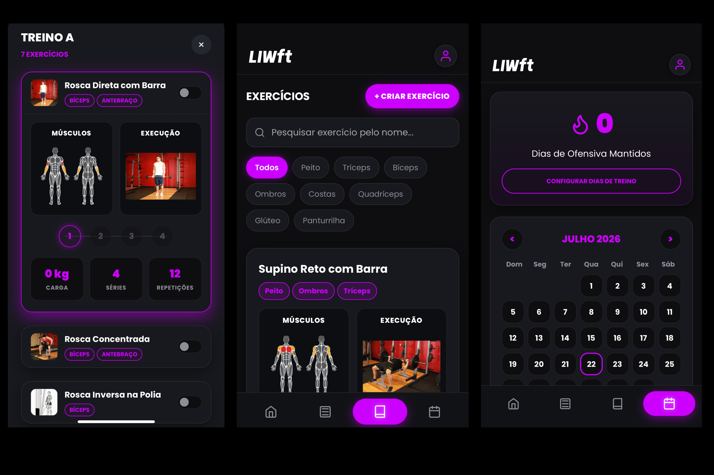

# 🏋️ `LIWft: Ficha de Treino e Gestão de Performance (WEB/PWA)`


> Este é um projeto desenvolvido **100% para uso pessoal**, criado do zero para suprir necessidades específicas da minha rotina de treinos que aplicativos comerciais tradicionais não atendiam, seja por falta de flexibilidade, poluição visual, excesso de recursos desnecessários ou modelos de cobrança abusivos (planos *premium* pagos). O sistema foi desenhado exatamente com base nas minhas preferências de usabilidade, estética escura moderna e fluxo direto de treino.

Este repositório contém o código-fonte da aplicação web *LIWft*, estruturada como um **PWA (Progressive Web App)** de alta performance. O sistema foca em uma experiência fluida (UX) voltada para dispositivos móveis, substituindo planilhas engessadas por um catálogo visual dinâmico, controle de séries interativo, rastreamento de ofensivas (*streak*) e gráficos de evolução corporal.

---

## 💡 `Sobre a Plataforma`

O *LIWft* foi projetado para oferecer controle total sobre os treinos diários e o acompanhamento físico, contando com os seguintes módulos:

* **Gestão de Treinos Semanais:** Visualização rápida da semana com calendário dinâmico e marcação de status de conclusão diária.
* **Sessão Ativa de Treino:** Modo de execução interativo com checklist de séries por toque, exibindo cards de anatomia muscular e demonstração de execução.
* **Biblioteca de Exercícios com API:** Catálogo integrado com busca em tempo real, filtros múltiplos por grupos musculares e carregamento automático de mídias de anatomia (*anatome.dev*).
* **Ficha Técnica e Evolução de Peso:** Perfil do atleta integrado com gráficos dinâmicos de peso (*Chart.js*) e histórico detalhado de sessões concluídas.
* **Controle de Ofensiva (Streak):** Sistema inteligente de contagem de dias consecutivos de treino com base em metas semanais personalizáveis.

---

## 💻 `Telas Principais`


| Telas do LIWft | Telas do LIWft |
| :---: | :---: |
|  |  | 

---

## 📱 `Funcionamento PWA e Como Usar no iPhone`

Embora seja uma aplicação hospedada na web, o *LIWft* utiliza tecnologias de **Progressive Web App (PWA)**, contando com um **Service Worker** para cache de ativos e funcionamento offline, além de metadados de instalação configurados no `manifest.json`.

Para transformar o site em um aplicativo nativo diretamente na tela inicial do seu iPhone:
1. Abra o link da aplicação no navegador **Safari** do seu iPhone.
2. Toque no botão de **Compartilhar** (o ícone de quadrado com seta para cima) localizado na barra inferior do navegador.
3. Role o menu de opções para baixo e selecione a opção **"Adicionar à Tela Inicial"**.
4. Confirme o nome do atalho (*MeuTreino*) e toque em **Adicionar**.
5. Pronto! O aplicativo será aberto em modo tela cheia (*standalone*), ocultando as barras do navegador e comportando-se exatamente como um app nativo instalado pela App Store, com suporte a cache offline.

---

## 🛠️ `Tecnologias e Conceitos Aplicados`

| Segmento | Stack Tecnológica | Bibliotecas, APIs e Conceitos |
| :--- | :--- | :--- |
| **Interface Web** | HTML5, CSS3, JavaScript (ES6) | Design Responsivo Mobile-First, Variáveis CSS, Suporte a Safe Area do iOS |
| **Gráficos e Mídias** | Chart.js | Renderização assíncrona de gráficos de peso corporal e histórico de sessões |
| **Arquitetura PWA** | Service Worker (`sw.js`), Web App Manifest | Cache dinâmico de recursos, modo *standalone* e suporte a execução offline |
| **Persistência de Dados** | Browser LocalStorage | Armazenamento local seguro para treinos, histórico, perfil e exercícios customizados |
| **APIs Externas** | Anatome.dev API | Mapeamento inteligente de musculatura e busca de GIFs demonstrativos de execução |

---

## 📁 `Estrutura do Repositório`

```text
LIWft/
├── assets/
│   ├── logo-LIWft.png       # Identidade visual da marca
│   └── [assets-musculos]    # Imagens de fundo e ícones de categorias de treino
├── index.html               # View principal e estrutura de navegação por abas (SPA)
├── style.css                # Estilização global, temas escuros, variáveis e tratamento de Safe Area
├── app.js                   # Controladores de UI, eventos de toque, gráficos e lógica de navegação
├── db.js                    # Camada de persistência (LocalStorage), chamadas assíncronas à API e regras de negócio
├── default-exercises.js     # Base de dados padrão de exercícios com termos em inglês para mapeamento
├── sw.js                    # Service Worker para controle de cache e suporte offline
└── manifest.json            # Configurações do PWA (metadados, ícones e comportamento standalone)